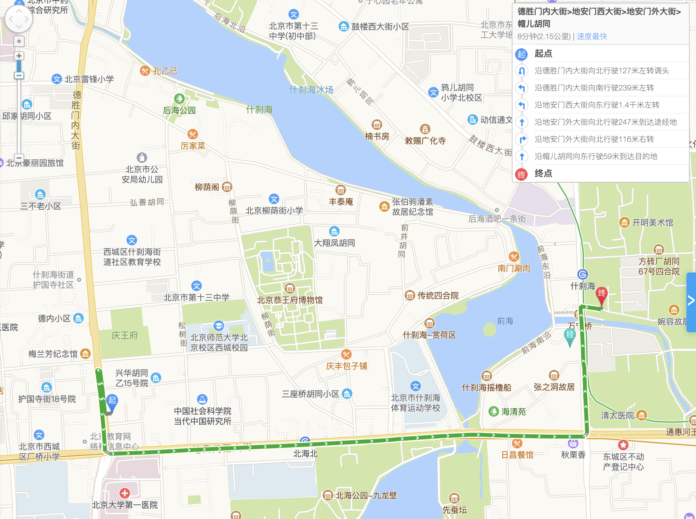
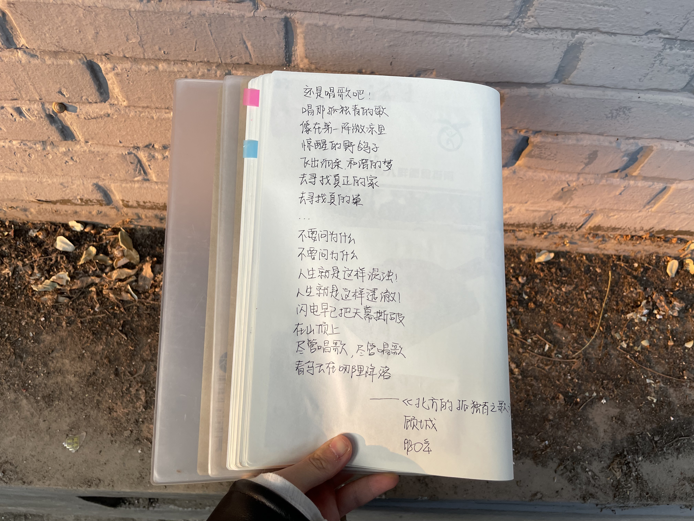
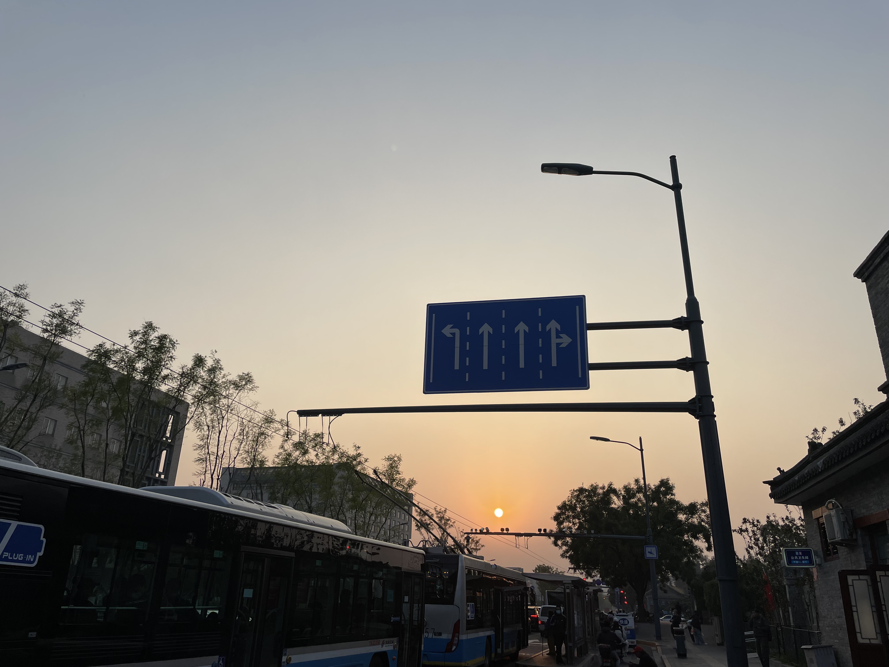

## 1. Intro
This is a project in memory of a Chinese poet, 顾城([Gu Cheng](https://en.wikipedia.org/wiki/Gu_Cheng)), which is named after his most known poem:

>***一代人***
>*黑夜给了我黑色的眼睛*
>*我却用它寻找光明*
>
>***One Generation***
>*Dark night endowed me with eyes for darkness,*
>*yet with them I seek light*

This poem uses metaphor to suggest that a certain generation of people suffering in a darkened age still yearn and search for light, hope, and beauteous things.

Because of its simplicity with powerful contrast, rhyme, and atmosphere, it was widely considered a masterpiece in Chinese modern poetry.

## 2. Mapping
In 1991-1993, Gu Cheng wrote an unfinished set of 52 poems, 城(the City), to recall the place in **Beijing** where he grow up with deep attachment and memory.

Through the power of his strong imagination, Gu Cheng can walk around Beijing even though he was living on another continent, to see things and places that did not exist anymore; he can “refurbish” or “rebuild” the gates pulled down, the bricks, the walls, the trees, in a moment, like a god with the power of his poetry and of his enchanting words. 

42 poems in this poem set are named after a place in Beijing, for example, 故宫(the Palace Museum), so I use Gaode Map Web API to geocode them and locate them into a map in QGIS **(by Add delimited text layer tool, with the '1991_1993.csv' as input)** to visualize and find patterns.

This is the geocode map in Chinese,

This is the geocode map in English.
*The official English names of these places are mostly 拼音(Pinyin), the romanization of a phonetic notation for Chinese characters, but my translation is based on its location type and meaning to facilitate understanding. For example, the 柳荫街(Liu Yin Jie) is translated as "Willow-shade Street".*

## 3. Patterns found
####Here are patterns I found according to the map:

1. **EVEN**
Places in his poems have a relatively even distribution inside Beijing Second Ring Road, with is known as the "old city part". 

2. **TWO-SIDES**
Place in poems written in 1991 and 1992 mainly distributed in the west and east sides of Beijing respectively.

3. **SHRINKING**
Place range shrank regularly from 1991 to 1993, and four places mentioned in 1993 are all in the "old city part".

4. **BRIDGE**
The bridge is the most mentioned place type, for example, 白石桥(Baishi Bridge).

####COINCIDENCE
Additionally, as I used the Mean Coordinates tool in QGIS to explore the places, I realize the point with mean coords of all places is pretty near the hospital he was born, which is a geographical coincidence or metaphor of life and death, for this poet set were written before his suicide.

The reverse geocoding shows this point is 中国儿童中心(China National Children's Center), and considering his hazy and sometimes child-like writing style, this is something even more profound.

## 4. Mourning 
#### Place, time, and route
On **Oct 7th**, the day before Gu Cheng's death anniversary, I decided to mourn him by going to several important places for him and planning my route using Gaode Map JS API. It was an intimidating time for going out, and I chose only three places to stay safe.

This is the map annotating places I would visit and why, and the English version.

This is a screenshot of my route planning.

#### Activities and thougts
Sadly, the area of these places are all tourist attractions now, with noisy restaurants in 帽儿胡同(Hat Hutong) and a bookstore under 地安门桥(Di'an Gate Bridge) closed for decades. 

In a pavilion bathing warm sunlight in dusk despite for loud crowd, I wrote down some lines in one of my favorite poems by Gu Cheng, 北方的孤独者之歌(Song of a Loner in North), and took a picture. 

I looked into the direction he mentioned in a letter explaining the poem set,

> *可以看见西直门——那黄昏凄凉的光芒照着堞垛和瓮城巨大的剪影，直洇开来……*
>
> *(In the direction)The desolate setting sun lingering on the magnificent wall of Xizhi Gate, and the silhouette creeps...*

yet the Xizhi Gate had been torn dowm, and here is the picture of the desolate setting sun.

To conclude, this project is my manifesto that poems encrypt the reality, like the hash function, in a private and dreamy way.

## Note

I declare NO interest in his love affairs, relationship, and homicide! It is his poems, and poems only that make me nostalgic and mourn him in this way.

For privacy concerns, I delete my API key in 'geocode.py' and 'route_planning.html'. If you want to run this code, please get your key [here](https://lbs.amap.com/api/webservice/summary/)

## Reference

[One Generation's translation](https://leonarddurso.com/2016/02/08/one-generation-by-gu-cheng/)

MARGARITO, A. S. (2012). Reflections of the West in Gu Cheng’s Life and Poems. Asian Studies, -16(2), 3–19. https://doi.org/10.4312/as.2012.-16.2.3-19

[顾城之城(Archive of Gu Cheng)](http://www.gucheng.net/index.htm)

